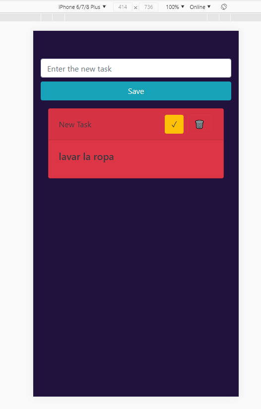

# TASK LIST con React & Typescript

Aplicación de prueba hecha para practicar la integración de typescript con react.

## Available Scripts

En este proyecto se podrán hacer hacer los siguientes scripts:

### `npm start`

Ejecuta aplicacion en ambiente local, por defecto en [running tests](http://localhost:3000).

### `npm test`

Launches the test runner in the interactive watch mode.\
See the section about [running tests](https://facebook.github.io/create-react-app/docs/running-tests) for more information.

### `npm run build`

Compila app para enviar a producción.

